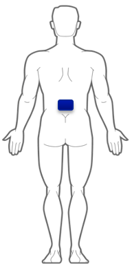

# Summary

Sit-to-stand transitions have been used to assess mobility for a broad range of conditions, such as Parkinson's Disease [@buckley:2008] and knee osteoarthritis [@bolink:2012]. Assessments are typically performed in the clinic using timed performance tests like the timed-up-and-go [@nguyen:2015; @nguyen:2017] and chair stand tests [@guralnik:1994]. While these assessment tools have demonstrated good psychometric properties, they have two key limitations: (1) assessments are performed episodically as they need to be administered by trained examiners, and (2) assessments performed in the clinic might not provide an adequate measure of real-world mobility. Therefore, there is a growing interest [@pham:2018; @martinez-hernandez:2019] in the use of wearable devices to detect sit-to-stand transitions that occur during daily life and quantify the quality of mobility during these transitions. 



``Sit2StandPy`` is an open source Python package that implements novel heuristics-based algorithms to detect Sit-to-Stand transitions from accelerometer data captured using a single wearable device mounted on the lower back (\autoref{fig:sensor_loc}). For each detected transition, the package also calculates objective features to assess quality of the transition. Features include duration, maximum acceleration, minimum acceleration, and spectral arc length (SPARC) [@balasubramanian:2015]. While most previous works have focused on either in-clinic applications [@van_lummel:2013; @nguyen:2015; @nguyen:2017] or the use of multiple sensors [@nguyen:2015; @nguyen:2017], the algorithms in this package can handle data collected under free-living conditions as well as prescribed tasks (e.g. 30-second chair stand task), and it uses only the acceleration data from a single sensor on the lower back with unconstrained device orientation. The practicality of a single-accelerometer approach, which affords a long battery life and improved wearability, makes it well suited for long-term, continuous monitoring at home.


As illustrated in \autoref{fig:proc_steps}, ``Sit2StandPy`` takes raw accelerometer data with timestamps as input and returns detected sit-to-stand transitions. Data can be windowed by full days, or parts of days can be selected for each window (e.g. window from 08:00 to 20:00). A high-level interface is provided, which allows the user to access all adjustable parameters. Users provide raw data as input and get detected transitions along with the computed features as output. Additionally, the lower-level methods that are called during the detection are available as well for more fine-grained control. 

With this framework, users can control many parameters of transition detection. In addition, the separation of processing steps and modularity of the sub-processes allows for easy customization if desired. For example, users can easily customize functions for generating additional features to assess quality of a transition.


# Current Work

The algorithms implemented in ``Sit2StandPy`` have been validated in healthy young and old adults as well as in older adults with Parkinson’s disease. Please refer to [@adamowicz:2020] for a detailed description of algorithms and results.

# Availability

``Sit2StandPy`` is distributed under the MIT License and is published on PyPI, the Python Package Index, and can be installed by running the following in the terminal:

```shell-script
pip install sit2standpy  # install with checking for dependencies
# or
pip install sit2standpy --no-deps  # installation without checking for installed dependencies
```

Sit2StandPy requires the following Python packages:

- Python >=3.6
- NumPy - [@numpy]
- SciPy - [@scipy]
- pandas - [@pandas]
- PyWavelets - [@pywavelets]
- udatetime

``Sit2StandPy`` contains example code with sample data in its GitHub repository. Full documentation with usage examples, installation instructions, and API reference are all available at [https://sit2standpy.readthedocs.io/en/latest/](https://sit2standpy.readthedocs.io/en/latest/)

# References
